# Daily Utility

> **One app. Every day-of-life utility.** Tasks, notes, finance, calculator, prayer, quiz, vault — all offline, all bilingual (বাংলা / English), all themed in light & dark.

[](#)
[](#)
[](#)
[](#)
[](#)

---

## ✨ What's inside

A single Material-3 Flutter app that ships **20+ daily-life features** end-to-end. Everything personal is stored **offline on the device** (Hive) — only public content (notice board, quiz categories) is fetched from Firebase Firestore.

| | |
|---|---|
| 🏠 **Home dashboard** | Mood selector · today's habits · active stories carousel · post studio · quick-launch chips |
| ✅ **Productivity** | Tasks (priority / recurrence / due date / reminder), Notes (checklists + colour tags) |
| 💸 **Finance** | Income/Expense with category breakdown, **Baki Khata** (people ledger), **Loan** tracker with EMI & reminders, **Subscriptions** (BDT/USD) |
| 🧮 **Utilities** | Calculator hub (20+ tools, 5 categories), **Unit Converter**, **Date Tools** (age / countdown / calendar) |
| 📿 **Lifestyle** | **Habit** tracker (streaks), **Mood / Daily Reflect**, **Shopping List**, **Prayer & Qibla** (offline via `adhan_dart`), **Reminders** |
| 🛡️ **Security** | **Password Vault** (weak/compromised detection) |
| 💬 **Social** | Posts feed + **Broadcast Studio** (carousel deck + AI Enhance) |
| 📰 **Content** | **Notice board** (Firestore), **Quiz** (Firestore, multi-category) |
| ⚙️ **System** | Profile, **Settings** (Bangla/English + theme), **Backup & Restore** (.json on-device), **Contact us** (Firestore) |

> 100 % Material 3 · fully responsive · dark theme first · bilingual (English / বাংলা) · built to be **boring on purpose** so your data stays yours.

---

## 📸 Screenshots

### Home & Dashboard

| Home Dashboard | Drawer (More menu) |
|---|---|
|  | 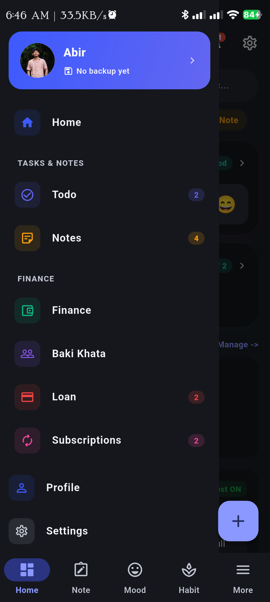 |

Quick-access chips for every section, today's mood emoji, today's habits at a glance, your active stories carousel, and the **Studio** button to publish a new post — all from one screen.

---

### Productivity

#### ✅ Tasks

| Active list | New task editor |
|---|---|
| 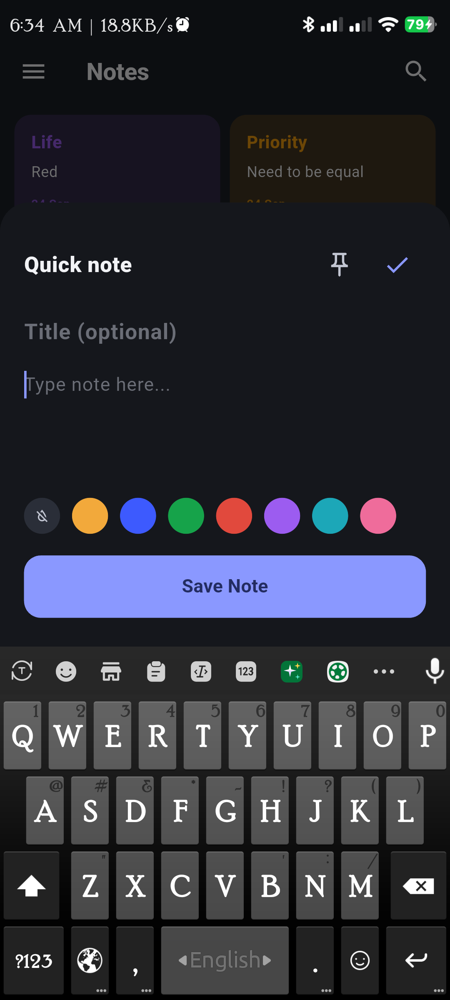 | 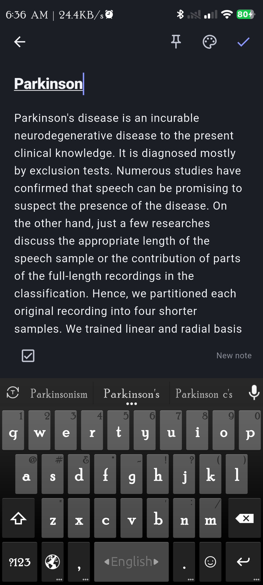 |

Priority · due date+time · recurrence (Once / Daily / Weekly / Monthly) · optional reminder 5 / 10 / 20 / 30 / 45 / 60 min before · completed-history tab.

#### 📝 Notes

| Quick-add (colour tags) | Full editor |
|---|---|
| 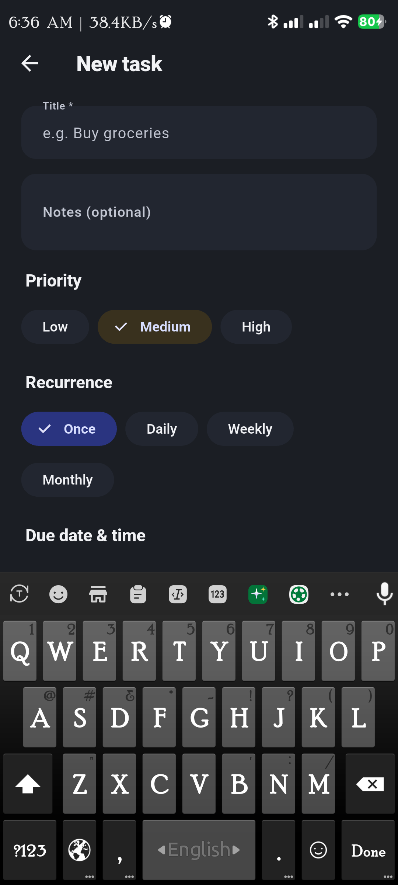 |  |

Text or checklist notes, pin-to-top, 7 colour tags.

---

### Finance

| Baki Khata (people ledger) | Finance dashboard | Loan tracker |
|---|---|---|
|  | 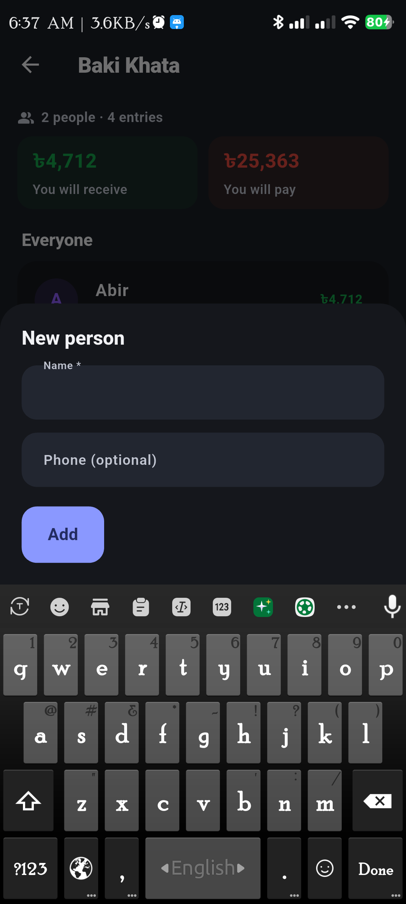 | 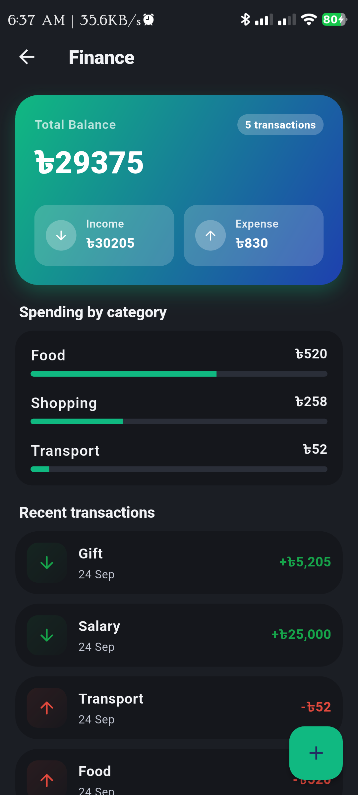 |

| New loan | New transaction | Subscriptions |
|---|---|---|
| 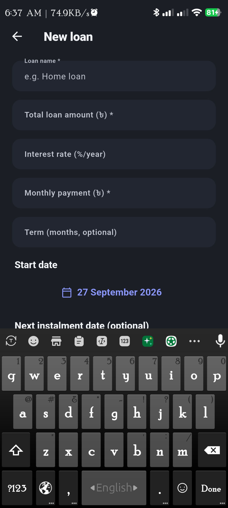 |  | 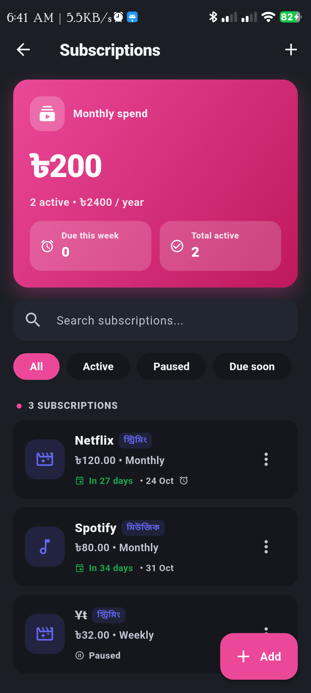 |

| New subscription | |
|---|---|
| 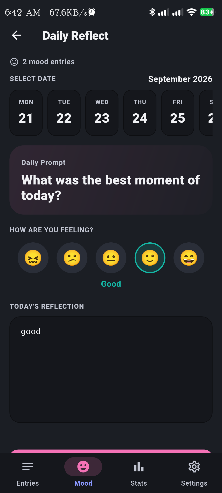 | |

Running balance for each person, per-category spend bars, instalment progress with reminders, and a Netflix/Spotify-grade subscription manager with custom billing cycles & currency.

---

### Utilities — Calculators & Converters

20+ calculators organised into 5 categories. Dark-theme friendly, instant results, optional history.

| Calculator hub | Unit Converter |
|---|---|
| 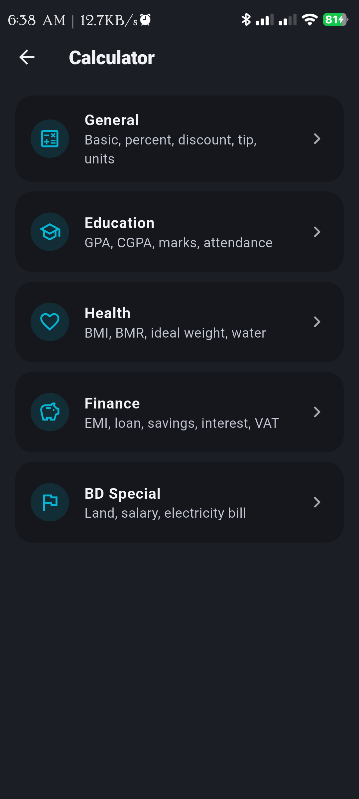 |  |

Categories: **General** (basic · percent · discount · tip · bill split) · **Education** (GPA · CGPA · marks % · attendance) · **Health** (BMI · BMR · ideal weight · water intake) · **Finance** (EMI · savings · simple interest · VAT) · **BD Special** (decimal↔katha↔bigha↔acre · feet↔হাত · salary breakdown · electricity-bill estimator).

Health calculators carry an explicit "not medical advice" banner.

---

### Date Tools hub

| Date Tools — Countdown tab |
|---|
|  |

Tabs: **Age** · **Days Between** · **Countdown** (shown above with event "পরীক্ষা") · **Calendar** (Flutter's built-in `CalendarDatePicker`).

---

### Shopping List

| Shopping List |
|---|
| 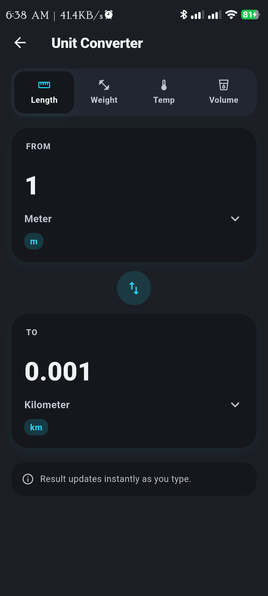 |

Tap-add with optional qty · check off · clear-checked.

---

### Vault — password manager

| Vault dashboard |
|---|
|  |

Searchable, categorised (Banking / Social / Work / …) · show/hide password · copy button · inline **Weak / Compromised** health meter.

---

### Social — Posts & Broadcast Studio

| Posts feed | Broadcast Studio |
|---|---|
|  |  |

A lightweight feed with search · tabs (All / Pinned / Diary / Thoughts) · a **Broadcast Studio** with multi-photo carousel editor, category chips, AI Enhance hint, and Publish Broadcast button.

---

### Habits, Mood & Daily Reflect

| Habits dashboard | Daily Reflect |
|---|---|
|  |  |

| New habit | |
|---|---|
| 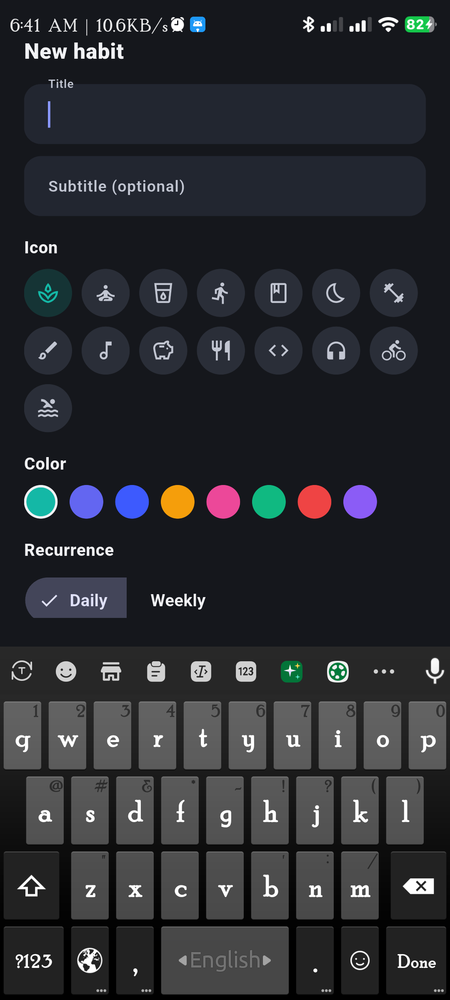 | |

Current streak + consistency % · weekly view (Mon–Sun) · per-day check · 14 hand-picked icons · 8 colour accents · recurrence (Daily / Weekly) · Monthly trend card.

**Mood / Daily Reflect** ships a daily prompt, 5-step emoji selector, this-month date strip, free-text reflection, and Entries / Mood / Stats / Settings tabs.

---

### Prayer & Qibla (fully offline)

| Today's schedule | Live Qibla compass |
|---|---|
| 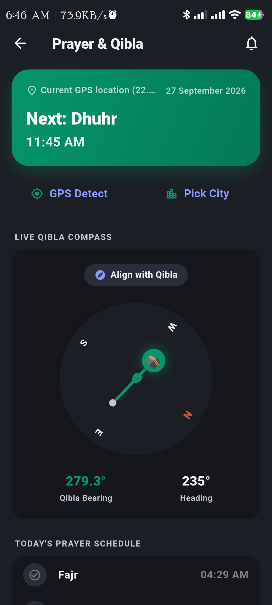 |  |

All five waqts · Bangladeshi preset cities · GPS detect · **Live Qibla compass** with bearing (°) & heading (°) · Tasbih counter · per-waqt reminders.

---

### Reminders, Quiz, Notices

| Aggregated Reminders | Quiz | Notice Board |
|---|---|---|
| 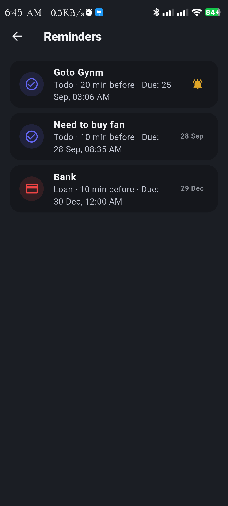 | (see Firestore section below) | (see Firestore section below) |

**Reminders** is one sorted list of every reminder created across Tasks and Loans — no separate "medicine reminder" screen, just create a recurring Todo.

---

### Profile, Settings, Backup, Contact us

| Profile | Settings |
|---|---|
|  | 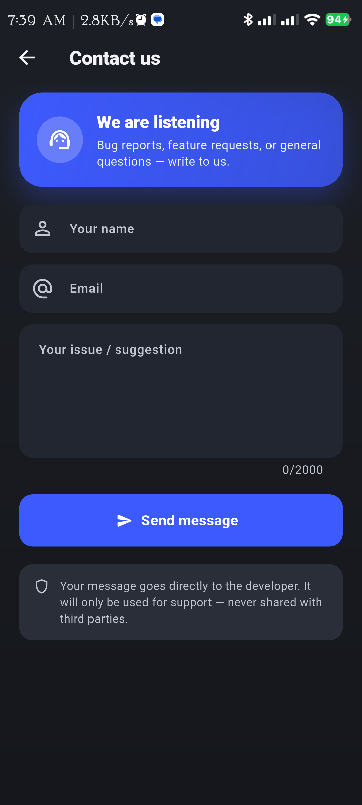 |

| Backup & Restore | Contact us |
|---|---|
| 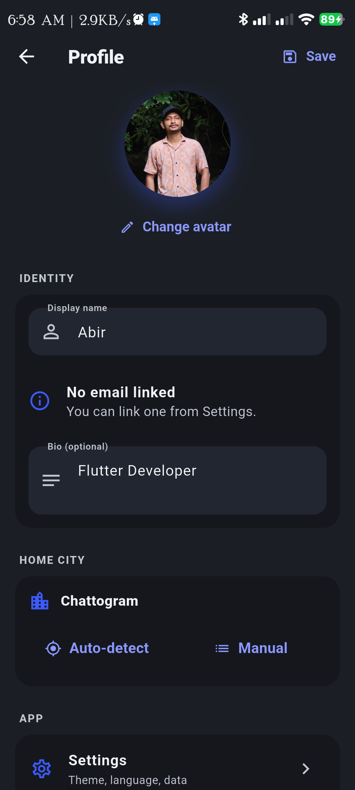 |  |

| Calculator history | |
|---|---|
|  | |

**Profile** — avatar, display name, bio, home city, settings shortcut.
**Settings** — Profile · Language (বাংলা / English) · Backup & restore · Theme (System / Light / Dark) · Clear history.
**Backup** — generates a single `.json` with *everything* (tasks, notes, finance, baki, loans, shopping, habits, mood, vault, quiz results, calculator history), lets you share it via WhatsApp / Email / Drive / Downloads. Restore by picking the file. **Safe & private** — the file never leaves your phone through a server.
**Contact us** — name + email + 2000-char message → directly stores a document in `contact_messages` Firestore (privacy footnote included).
**Calculator history** — filterable log of every prior calculation & transaction grouped by tool.

---

## 🛠️ Tech stack

| Layer            | Choice                                                                 |
|------------------|------------------------------------------------------------------------|
| Framework        | **Flutter 3.x / Dart 3.x** — Material 3                                |
| Local persistence| **Hive** — offline-first for *all* personal data                       |
| Cloud            | **Firebase Firestore** — public content only (notices, quizzes, contact) |
| State            | `ValueNotifier` per-service singletons                                 |
| Theming          | `Theme.of(context).colorScheme.*` tokens (no hardcoded hex in screens) |
| Reminders        | `flutter_local_notifications`                                          |
| Prayer times     | `adhan_dart` (offline astronomical calc, Karachi + Hanafi)            |
| Location         | `geolocator` (Qibla + GPS detect)                                      |
| Sharing          | `share_plus` (backup file share)                                       |
| Codegen          | Hand-written `TypeAdapter`s (no `build_runner` dependency)            |

---

## 🧱 Features in detail

### Productivity
- **Todo** — priority, due date+time, recurring (daily / weekly / monthly — completing a recurring task logs it to history and rolls the live task to its next date), optional reminder (5/10/20/30/45/60 min before), completed history tab.
- **Notes** — text or checklist notes, pin-to-top, colour tags.

### Finance
- **Finance** — income/expense, categories, balance, per-category spend breakdown.
- **Baki Khata** — people, running balance (receivable/payable), "gave" / "got" transaction log.
- **Loan** — principal / rate / instalment, payment history, remaining-balance progress bar, optional reminder for the next instalment.
- **Subscriptions** — Netflix / Spotify / etc. style manager with weekly / monthly / quarterly / yearly cycles, multi-currency, pause/resume, due-soon filter, monthly spend summary card.

### Calculators & Converters
**20+ calculators** across:
- *General* — basic 4-function, percentage, discount, tip + bill-split
- *Education* — GPA / CGPA, marks %, attendance
- *Health* — BMI, BMR, ideal weight, water intake (banner: *not medical advice*)
- *Finance* — EMI, savings, simple interest, VAT
- *BD Special* — Bangladesh land-unit converter (decimal / katha / bigha / acre), feet↔হাত, salary breakdown, electricity-bill estimator

Plus **Unit Converter** (Length / Weight / Temp / Volume) and **Date Tools** (Age / Days Between / Countdown / Calendar).

### Lifestyle
- **Habits** — current streak, consistency %, weekly view, monthly trend, 14 icons, 8 colours.
- **Mood / Daily Reflect** — daily prompt, 5-step emoji, free-text reflection, monthly calendar of entries.
- **Shopping List** — quick-add, qty, check off, clear-checked.
- **Prayer & Qibla** — *fully offline*. Coordinates are cached in Hive so the last-used location persists. Includes 8 Bangladeshi city presets, **GPS Detect**, a **live Qibla compass** (bearing ° + heading °), Tasbih counter, per-waqt reminders before each of the 5 prayer times.
- **Reminders** — one aggregated sorted view across Todo + Loan.

### Security
- **Vault** — local password/credential store. Categorised (All / Banking / Social / Work / …), searchable, show/hide, copy. Inline **Security Health** meter shows "Weak" and "Compromised" counts so you can see at a glance which logins need attention.

### Social
- **Posts** — feed with search + chips (All / Pinned / Diary / Thoughts / …), like / share counters.
- **Broadcast Studio** — multi-image carousel deck, square / story aspect selector, **AI Enhance** hint button, category tags (Diary / Thoughts / Recipe), Save Draft / Publish.

### Content (Firestore-backed)
- **Notice Board** — admin pushes `title / para / imgurl / linkurl / isPinned`; users read.
- **Quiz** — multi-category. Each Firestore document = one category; its `questions` array holds 4-option MCQs. Adding a doc in the console = new category appears in the app automatically, no update needed.

### System
- **Profile** — avatar (gallery), display name, bio, home city (auto-detect or manual city list).
- **Settings** — Language (English / বাংলা), Theme (System / Light / Dark), Backup, Clear history.
- **Backup & Restore** — single `.json` of every Hive box, share-sheet / picker. Safe & private (file never leaves your phone through a server).
- **Contact us** — writes a new document to the `contact_messages` Firestore collection.

---

## 🔥 Firebase setup

The app talks to **one** Firestore project. Three collections are touched at runtime (see [`firestore.rules`](firestore.rules)):

| Collection         | Read    | Write (create) | Write (update/delete) |
|--------------------|---------|----------------|-----------------------|
| `notice`           | public  | admin only     | admin only            |
| `quiz_categories`  | public  | admin only     | admin only            |
| `contact_messages` | admin   | public         | admin only            |

### `notice/{docId}`

| Field      | Type   | Required | Notes                        |
|------------|--------|----------|------------------------------|
| `title`    | string | yes      | Headline                     |
| `para`     | string | yes      | Body text                    |
| `imgurl`   | string | no       | Optional image URL           |
| `linkurl`  | string | no       | Optional "Read more" link    |
| `isPinned` | bool   | no       | Pinned to top                |

### `quiz_categories/{docId}`

| Field       | Type     | Required | Notes                                      |
|-------------|----------|----------|--------------------------------------------|
| `name`      | string   | yes      | Display title (e.g. `"Physics"`)          |
| `subtitle`  | string   | no       | Shown under title                          |
| `icon`      | string   | no       | One of: `science`, `physics`, `chemistry`, `biology`, `math`, `history`, `geography`, `gk`, `art`, `language`, `sports`, `music`, `movies`, `tech` |
| `color`     | string   | no       | Hex like `0xFF14B8A6` or `#14B8A6`         |
| `order`     | number   | no       | Ascending sort key                         |
| `questions` | array    | yes      | `[{q, options[4], answer, hint?}]`         |

Question shape:
```json
{
  "q": "What is the SI unit of force?",
  "options": ["Joule","Newton","Watt","Pascal"],
  "answer": 1,
  "hint": "Named after the father of mechanics."
}
```

To add a new category: just create another document in `quiz_categories` from the Firebase console. The next app refresh picks it up automatically — **no app update needed**.

### `contact_messages/{docId}`

| Field        | Type      | Required | Notes                                  |
|--------------|-----------|----------|----------------------------------------|
| `name`       | string    | yes      | Sender's name                          |
| `email`      | string    | yes      | Sender's email (used to reply)         |
| `message`    | string    | yes      | Issue / suggestion body                |
| `createdAt`  | timestamp | server   | Server-set when document is created    |
| `appVersion` | string    | no       | App version at submission              |
| `platform`   | string    | no       | OS / platform info                     |
| `locale`     | string    | no       | UI locale (`bn` / `en`)                |

Submissions are visible from the Firebase console → Firestore → `contact_messages`. For auto-forwarding to a Gmail address, install the official **"Trigger Email"** Firebase Extension and point it at the collection.

### Deploy the rules

```bash
firebase deploy --only firestore:rules
```

The shipped [`firestore.rules`](firestore.rules) gives public-read / admin-write for `notice` and `quiz_categories`, and public-create / admin-read for `contact_messages`. Everything else is default-deny.

---

## 💾 Local persistence (Hive)

Everything except notices / quizzes / contact is **offline on the device**. Because this project can't run `build_runner` in the sandbox, every model has a **hand-written** `TypeAdapter` (in the same file as the model) — functionally identical to the generated code, just written by hand.

---

## ▶️ Build & run

### 1. First-time setup

```bash
cd daily_utility
flutter create .           # generates android/, ios/, etc. — safe; does not touch lib/ or pubspec.yaml
flutter pub get
```

### 2. Add permissions

**`android/app/src/main/AndroidManifest.xml`** — add inside `<manifest>`, above `<application>`:

```xml
<uses-permission android:name="android.permission.POST_NOTIFICATIONS"/>
<uses-permission android:name="android.permission.SCHEDULE_EXACT_ALARM"/>
<uses-permission android:name="android.permission.RECEIVE_BOOT_COMPLETED"/>
<uses-permission android:name="android.permission.ACCESS_FINE_LOCATION"/>
<uses-permission android:name="android.permission.ACCESS_COARSE_LOCATION"/>
```

**`ios/Runner/Info.plist`** — add:

```xml
<key>NSLocationWhenInUseUsageDescription</key>
<string>Prayer times and Qibla direction need your location.</string>
```

### 3. Run

```bash
flutter analyze            # catch any lint drift before shipping
flutter run
```

To point the app at your own Firestore project, edit `lib/firebase_options.dart` with your project's credentials.

---

## 📁 Project structure (high-level)

```
lib/
├── main.dart
├── firebase_options.dart          # Firebase config (per-platform)
├── firestore.rules                # Firestore security rules
│
├── theme/app_theme.dart           # Material 3 colour scheme + tokens
├── models/                        # Hand-written Hive TypeAdapters live here
│   ├── todo.dart
│   ├── note.dart
│   ├── finance_transaction.dart
│   ├── baki_person.dart
│   ├── loan.dart
│   ├── subscription.dart
│   ├── habit.dart
│   ├── mood_entry.dart
│   ├── vault_entry.dart
│   ├── quiz_category.dart         # + fromDoc() factory
│   └── quiz_result.dart
│
├── services/                      # Singletons with ValueNotifier<...>
│   ├── todo_service.dart
│   ├── note_service.dart
│   ├── finance_service.dart
│   ├── baki_service.dart
│   ├── loan_service.dart
│   ├── subscription_service.dart
│   ├── habit_service.dart
│   ├── mood_service.dart
│   ├── shopping_service.dart
│   ├── vault_service.dart
│   ├── backup_service.dart        # share / restore .json
│   ├── notice_service.dart        # Firebase
│   ├── quiz_service.dart          # Firebase
│   └── contact_service.dart       # Firebase
│
├── screens/                       # Top-level pages
│   ├── home/                      # Home dashboard, broadcast studio
│   ├── notes/
│   ├── todo/
│   ├── finance/                   # finance + baki + loan + subs
│   ├── habit/
│   ├── mood/
│   ├── settings/
│   ├── contact/
│   ├── vault/
│   ├── posts/
│   ├── notices/
│   ├── quiz/                      # category hub + quiz player
│   ├── calculator/                # hub + 20 calculator pages
│   ├── date_tools/                # hub + age/days/countdown/calendar
│   ├── shopping/
│   ├── unit_converter/
│   ├── backup/
│   ├── prayer/                    # offline prayer + Qibla
│   ├── reminders/
│   └── profile/
│
├── widgets/                       # Shared building blocks
│   ├── app_drawer.dart
│   ├── section_card.dart
│   └── ...
│
└── l10n_strings.dart              # bilingual tr(context, bn, en) helper
```

---

## ✅ What works right now

- All 20+ features end-to-end with persisted state
- Full bilingual UI (English / বাংলা) with runtime language switch
- Light + dark Material 3 themes (no hardcoded hex in any screen)
- Offline-first for personal data (Hive) · cloud for public content (Firestore)
- Empty-state UX on every cloud-backed screen with copy-pasteable setup hints
- Search, filter, sort, swipe-to-delete everywhere it makes sense
- Pull-to-refresh on every list that talks to Firestore
- Backup / Restore that round-trips every Hive box

## 📋 Known gaps / intentional non-features

- **Voice notes** — data model only; the recording UI isn't built. (audio capture needs a separate plugin + platform permission wiring chunk of work)
- **Qibla** — live compass is implemented; magnetic compass sensor is **not** wired up (numerical bearing only)
- **Quiz authoring UI** — author via Firestore console, by design
- **Contact-form auto-email** — submissions land in Firestore; pair with the **Trigger Email** extension if you want Gmail delivery
- **Per-feature favourite / pin** — top-level only; no per-tool star

---

## 🤝 Contributing

PRs welcome — keep new features behind a single screen + a single service, and follow the existing `ValueNotifier` + `Theme.of(context).colorScheme` patterns. Read `SETUP_AND_FEATURES.md` for the deeper architecture notes.

## 📜 License

MIT — see `LICENSE` (or `LICENSE.md`) if present, otherwise the standard MIT terms apply.

---

> Built with ❤️ in Bangladesh · *Daily Utility — everything you'd otherwise install 12 apps for.*
